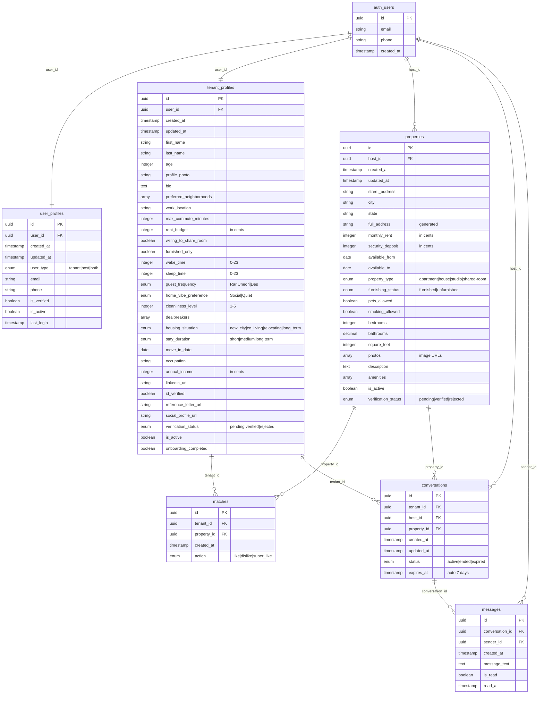

# 🏠 rentPairs - Smart Rental Matching Platform

A modern, AI-powered rental matching platform that connects property hosts with ideal tenants through intelligent matching algorithms and streamlined onboarding flows.

[](https://vercel.com/vicorico17s-projects/v0-rental-match-web-app)
[](https://nextjs.org/)
[](https://supabase.com/)

## 🌟 Overview

**rentPairs** is a comprehensive rental matching platform that revolutionizes how tenants find properties and hosts find ideal renters. Using smart matching algorithms based on lifestyle compatibility, budget alignment, and location preferences, we create meaningful connections in the rental market.

### ✨ Key Features

- **🎯 Smart Matching Algorithm** - AI-powered compatibility scoring based on 30+ data points
- **📱 Tinder-Style Swiping** - Intuitive property discovery for tenants
- **💬 Real-Time Chat** - Instant messaging between hosts and tenants
- **📝 Comprehensive Onboarding** - Detailed preference and lifestyle profiling
- **🏡 Property Management** - Full-featured property listing and management
- **🔒 Trust & Safety** - Identity verification and reference checking
- **📅 Lease Planning** - Integrated lease agreement management
- **📊 Match Analytics** - Detailed compatibility insights

## 🛠 Tech Stack

### Frontend
- **Next.js 15** - React framework with App Router
- **React 19** - Latest React with Server Components
- **TypeScript** - Type-safe development
- **Tailwind CSS** - Utility-first styling
- **Radix UI** - Accessible component primitives
- **Framer Motion** - Smooth animations and transitions

### Backend & Database
- **Supabase** - PostgreSQL database with real-time features
- **Row Level Security (RLS)** - Database-level security
- **Real-time Subscriptions** - Live chat and notifications
- **Supabase Auth** - Authentication and user management

### Development Tools
- **ESLint** - Code linting
- **Prettier** - Code formatting
- **Git** - Version control

## 📊 Database Schema

Our database is designed for scalability and performance with comprehensive relationships:



### Database Tables Overview

| Table | Purpose | Key Features |
|-------|---------|--------------|
| `auth_users` | Supabase authentication | Built-in user management |
| `user_profiles` | Base user information | User type (tenant/host/both) |
| `tenant_profiles` | Tenant onboarding data | 32 fields covering preferences, lifestyle, verification |
| `properties` | Property listings | Complete property details, photos, amenities |
| `matches` | Tenant-Property interactions | Likes, dislikes, super likes |
| `conversations` | Chat sessions | Auto-expiring conversations (7 days) |
| `messages` | Real-time messaging | Read receipts, timestamps |

## 🚀 Getting Started

### Prerequisites

- Node.js 18+ 
- npm or pnpm
- Supabase account

### Installation

1. **Clone the repository**
   ```bash
   git clone https://github.com/Vicorico17/rentPairs.git
   cd rentPairs
   ```

2. **Install dependencies**
   ```bash
   npm install --legacy-peer-deps
   ```

3. **Set up environment variables**
   
   Create `.env.local` in the project root:
   ```env
   NEXT_PUBLIC_SUPABASE_URL=your_supabase_url
   NEXT_PUBLIC_SUPABASE_ANON_KEY=your_supabase_anon_key
   ```

4. **Run the development server**
   ```bash
   npm run dev
   ```

5. **Open your browser**
   
   Navigate to [http://localhost:3000](http://localhost:3000)

### Database Setup

The database schema is already configured in Supabase with:
- ✅ Row Level Security (RLS) policies
- ✅ Real-time subscriptions for messaging
- ✅ Helper functions for match scoring
- ✅ Auto-expiring conversations
- ✅ Comprehensive indexes for performance

## 📁 Project Structure

```
rentPairs/
├── app/                    # Next.js App Router
│   ├── globals.css        # Global styles
│   ├── layout.tsx         # Root layout
│   ├── loading.tsx        # Loading UI
│   └── page.tsx           # Home page with routing
├── components/            # React components
│   ├── ui/               # Reusable UI components (Radix + Tailwind)
│   ├── onboarding/       # Tenant onboarding flow
│   ├── onboarding-host/  # Host onboarding flow
│   ├── auth-page.tsx     # Authentication
│   ├── chat-interface.tsx # Real-time messaging
│   ├── matching-interface.tsx # Property swiping
│   └── ...               # Other feature components
├── lib/                  # Utility functions and configurations
│   ├── supabase.ts      # Supabase client and types
│   ├── types.ts         # TypeScript type definitions
│   ├── utils.ts         # Helper functions
│   └── data.ts          # Mock data for development
├── hooks/               # Custom React hooks
├── public/             # Static assets
└── styles/             # Additional stylesheets
```

## 🎯 User Flows

### Tenant Journey
1. **Landing Page** - Choose "Looking for a place"
2. **Onboarding** - 7-step process:
   - Location preferences
   - Budget and room sharing
   - Lifestyle (sleep schedule, cleanliness, social preferences)
   - Dealbreakers
   - Housing situation and timeline
   - Community preferences
   - Verification and profile building
3. **Matching** - Swipe through compatible properties
4. **Chat** - Connect with interested hosts
5. **Lease Planning** - Move forward with agreements

### Host Journey
1. **Landing Page** - Choose "I have a place to rent"
2. **Property Listing** - 5-step process:
   - Property address
   - Pricing and availability
   - Property details and rules
   - Photo uploads and description
   - Review and publish
3. **Tenant Review** - See tenant profiles who liked your property
4. **Chat** - Connect with potential tenants
5. **Lease Management** - Handle agreements and move-ins

## 🔒 Security Features

- **Row Level Security (RLS)** - Database-level access control
- **Authentication** - Supabase Auth integration
- **Data Validation** - Comprehensive input validation
- **Privacy Controls** - Granular data sharing permissions
- **Verification System** - Identity and reference verification

## 🚀 Deployment

The application is configured for easy deployment on Vercel:

1. **Environment Variables** - Set up in Vercel dashboard
2. **Database** - Already configured in Supabase
3. **Build Settings** - Optimized for Next.js 15

**Live Demo:** [https://vercel.com/vicorico17s-projects/v0-rental-match-web-app](https://vercel.com/vicorico17s-projects/v0-rental-match-web-app)

## 📈 Performance Optimizations

- **Next.js 15 App Router** - Server Components and streaming
- **Database Indexes** - Optimized queries for matching algorithms
- **Image Optimization** - Next.js automatic image optimization
- **Code Splitting** - Lazy loading of components
- **Caching** - Strategic caching of API responses

## 🤝 Contributing

1. Fork the repository
2. Create a feature branch (`git checkout -b feature/amazing-feature`)
3. Commit your changes (`git commit -m 'Add amazing feature'`)
4. Push to the branch (`git push origin feature/amazing-feature`)
5. Open a Pull Request

## 📝 License

This project is licensed under the MIT License - see the [LICENSE](LICENSE) file for details.

## 🆘 Support

For support and questions:
- 📧 Email: [support@rentpairs.com](mailto:support@rentpairs.com)
- 💬 GitHub Issues: [Create an issue](https://github.com/Vicorico17/rentPairs/issues)

---

**Built with ❤️ using Next.js, Supabase, and modern web technologies**